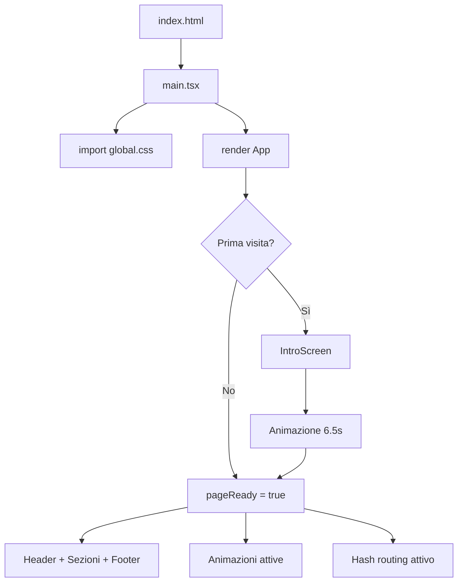
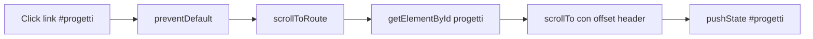

# Guida di studio completa — mio-portfolio

> Documento personale per studiare e capire ogni parte del progetto.
> Portfolio di **Filippo Dimita** — Full Stack Developer.

---

## Indice

1. [Cos'è questo progetto](#1-cosè-questo-progetto)
2. [Stack tecnologico](#2-stack-tecnologico)
3. [Come si avvia il sito](#3-come-si-avvia-il-sito)
4. [Struttura delle cartelle](#4-struttura-delle-cartelle)
5. [index.html — la shell HTML](#5-indexhtml--la-shell-html)
6. [I file CSS](#6-i-file-css)
7. [I dati statici (`src/data/`)](#7-i-dati-statici-srcdata)
8. [Le utility (`src/lib/`)](#8-le-utility-srclib)
9. [Gli hook (`src/hooks/`)](#9-gli-hook-srchooks)
10. [Context e gestione dello stato](#10-context-e-gestione-dello-stato)
11. [Flusso principale: `App.tsx`](#11-flusso-principale-apptsx)
12. [Sistema di animazioni](#12-sistema-di-animazioni)
13. [Navigazione a hash (senza React Router)](#13-navigazione-a-hash-senza-react-router)
14. [Form contatti — flusso completo](#14-form-contatti--flusso-completo)
15. [Ogni componente spiegato](#15-ogni-componente-spiegato)
16. [Configurazione: Vite, TypeScript, Vercel](#16-configurazione-vite-typescript-vercel)
17. [Test automatici](#17-test-automatici)
18. [Come modificare i contenuti](#18-come-modificare-i-contenuti)
19. [Diagrammi di flusso](#19-diagrammi-di-flusso)
20. [Glossario](#20-glossario)

---

## 1. Cos'è questo progetto

È un **sito portfolio a pagina singola** (SPA — Single Page Application):

- Una sola pagina HTML (`index.html`)
- React monta tutto dentro `<div id="root">`
- Le "sezioni" (Hero, Progetti, Skills…) sono `<section>` sulla stessa pagina
- La navigazione usa gli **hash nell'URL** (`#progetti`, `#contatti`) senza cambiare pagina
- I contenuti (testi, progetti, skills) sono **file TypeScript statici** in `src/data/`
- Il form contatti invia email tramite **FormSubmit** (servizio esterno, nessun backend proprio)
- Deploy su **Vercel** come sito statico

**Non usa:** React Router, database, server Node, autenticazione.

---

## 2. Stack tecnologico

| Tecnologia | Ruolo |
|------------|-------|
| **React 19** | Libreria UI a componenti |
| **TypeScript** | Tipizzazione statica (`strict: true`) |
| **Vite 8** | Build tool e dev server veloce |
| **Tailwind CSS 4** | Utility CSS + design tokens in `@theme` |
| **Motion** (ex Framer Motion) | Animazioni React |
| **Sonner** | Toast/notifiche |
| **Radix Icons** + **react-icons** | Icone |
| **clsx** + **tailwind-merge** | Merge classi CSS |
| **Vitest** | Test unitari |
| **FormSubmit** | Invio email dal form |
| **ESLint** | Controllo qualità codice |

---

## 3. Come si avvia il sito

```
index.html
    └── carica /src/main.tsx
            └── importa global.css
            └── createRoot(#root).render(<App />)
```

### `src/main.tsx`

```tsx
import { StrictMode } from 'react'
import { createRoot } from 'react-dom/client'
import './styles/global.css'
import App from './App.tsx'

createRoot(document.getElementById('root')!).render(
  <StrictMode>
    <App />
  </StrictMode>,
)
```

| Parte | Cosa fa |
|-------|---------|
| `StrictMode` | Modalità React che segnala problemi in dev (doppio render, API deprecate) |
| `createRoot` | API React 18+ per montare l'app |
| `getElementById('root')!` | Trova il div in `index.html`; `!` = TypeScript sa che non è null |
| `import './styles/global.css'` | Carica tutti gli stili (Tailwind + componenti + intro + toaster) |

### Script npm

| Comando | Cosa fa |
|---------|---------|
| `npm run dev` | Server locale su `http://localhost:5173` |
| `npm run build` | Controlla TypeScript + crea cartella `dist/` |
| `npm run preview` | Anteprima della build di produzione |
| `npm run lint` | Esegue ESLint |
| `npm run test` | Esegue i test Vitest |
| `npm run test:watch` | Test in modalità continua |

---

## 4. Struttura delle cartelle

```
mio-portfolio/
├── index.html              # Shell HTML (meta, font, mount point)
├── package.json            # Dipendenze e script
├── vite.config.ts          # Config Vite + Tailwind + Vitest
├── vercel.json             # Deploy: rewrite CV, security headers
├── tsconfig.app.json       # TypeScript strict per src/
├── .env.example            # Template variabili ambiente
├── GUIDA-STUDIO.md         # Questo file
│
├── public/                 # File serviti così come sono (URL diretto)
│   └── cv/
│       └── Filippo_Dimita_CV.pdf
│
└── src/
    ├── main.tsx            # Entry point React
    ├── App.tsx             # Componente radice
    │
    ├── assets/             # Immagini importate da Vite (con hash in build)
    │   ├── banner-header.png
    │   └── logo-fd.png
    │
    ├── styles/
    │   ├── global.css      # Tema, reset, classi componenti
    │   ├── intro.css       # Animazioni schermata intro
    │   └── toaster.css     # Stili notifiche Sonner
    │
    ├── data/               # CONTENUTI EDITABILI (testi, link, progetti)
    ├── hooks/              # Logica riusabile React
    ├── lib/                # Funzioni pure / utility
    ├── context/            # React Context
    └── components/         # Componenti UI per sezione
```

### Regola pratica

| Cartella | Quando la tocchi |
|----------|------------------|
| `data/` | Vuoi cambiare testi, progetti, link, menu |
| `components/` | Vuoi cambiare layout o UI |
| `styles/` | Vuoi cambiare colori, spaziature, animazioni CSS |
| `lib/` | Vuoi cambiare logica (form, scroll, validazione) |
| `hooks/` | Vuoi cambiare comportamento riusabile |

---

## 5. `index.html` — la shell HTML

```html
<!doctype html>
<html lang="it">
  <head>
    <meta charset="UTF-8" />
    <link rel="icon" type="image/png" href="/src/assets/logo-fd.png" />
    <link rel="apple-touch-icon" href="/src/assets/logo-fd.png" />
    <meta name="viewport" content="width=device-width, initial-scale=1.0, viewport-fit=cover" />
    <meta name="description" content="Filippo Dimita — Full Stack Developer..." />
    <meta name="theme-color" content="#050608" />
    <title>Filippo Dimita | Full Stack Developer</title>
    <!-- Google Fonts: Inter + JetBrains Mono -->
  </head>
  <body>
    <div id="root"></div>
    <script type="module" src="/src/main.tsx"></script>
  </body>
</html>
```

| Elemento | Perché c'è |
|----------|------------|
| `lang="it"` | Lingua italiana per screen reader e SEO |
| `charset="UTF-8"` | Caratteri accentati italiani corretti |
| `rel="icon"` | Favicon nella tab del browser (Vite la processa in build) |
| `apple-touch-icon` | Icona se aggiungi il sito alla home su iPhone |
| `viewport` + `viewport-fit=cover` | Layout responsive + notch iPhone |
| `description` | Testo per Google e anteprime link |
| `theme-color` | Colore barra browser mobile (`#050608` = sfondo scuro) |
| `preconnect` ai font | Carica Google Fonts più velocemente |
| `#root` | Dove React monta tutta l'app |
| `type="module"` | Vite usa ES modules |

---

## 6. I file CSS

### 6.1 `global.css` — il cuore del design

#### Import e tema Tailwind v4

```css
@import 'tailwindcss';

@theme {
  --color-bg: #050608;
  --color-accent: #3dd9ee;
  --font-sans: 'Inter', system-ui, ...;
  --font-mono: 'JetBrains Mono', ...;
  --spacing-nav: 3rem;
  --max-width-content: 67.5rem;
  /* ... altri token colore bento, testo, bordi ... */
}
```

I token `@theme` diventano classi Tailwind: `bg-bg`, `text-accent`, `border-border`, `font-mono`, ecc.

#### `@layer base` — reset globale

| Regola | Scopo |
|--------|-------|
| `box-sizing: border-box` | Padding incluso nella larghezza |
| `scroll-behavior: smooth` | Scroll fluido (disabilitato con reduced-motion) |
| `scroll-padding-top` | Compensa header sticky quando vai a `#sezione` |
| `min-height: 100svh` | Altezza viewport mobile corretta |
| `safe-area-inset` | Margini per notch iPhone |
| `overflow-x: hidden` | Niente scroll orizzontale |
| `:focus-visible` | Outline ciano per navigazione tastiera |
| `.sr-only` | Testo visibile solo agli screen reader |

#### `@layer components` — classi riusabili

| Classe | Uso nel progetto |
|--------|------------------|
| `.container-page` | Contenitore centrato con padding responsive |
| `.section-padding` | Spaziatura verticale sezioni |
| `.scroll-section` | `scroll-margin-top` per hash navigation |
| `.touch-target` | Minimo 44×44px per touch (accessibilità) |
| `.eyebrow` | Etichetta sezione (`// progetti`) |
| `.tech-label` | Label mono uppercase |
| `.field-label` / `.field-input` | Form contatti |
| `.btn-primary` / `.btn-secondary` | Pulsanti CTA |
| `.bento-grid` / `.bento-cell` | Sistema griglia bento |
| `.bento-chip` | Chip tecnologie |
| `.matrix-btn__canvas` | Canvas effetto Matrix sui bottoni |

#### Varianti bento (`bento-cell--*`)

| Variante | Aspetto |
|----------|---------|
| `--intro` | Gradiente hero, glow in alto a sinistra |
| `--accent` | Bordo sinistro ciano |
| `--featured` | Gradiente più ricco, progetto in evidenza |
| `--muted` | Sfondo scuro attenuato |
| `--card` | Card standard |
| `--links` | Celle con link rapidi |
| `--cta-primary` / `--cta-secondary` | Celle con pulsanti azione |

#### Import finali

```css
@import './intro.css';
@import './toaster.css';
```

---

### 6.2 `intro.css` — schermata Bat-Signal

Animazioni CSS pure per `IntroScreen`. Non usa Motion/React.

| Classe | Ruolo |
|--------|-------|
| `.intro-screen` | Overlay fullscreen `z-index: 200` |
| `.intro-signal-disk` | Disco luminoso con logo |
| `.intro-beam` | Raggio verticale dal basso |
| `.intro-projector` | Proiettore in basso |
| `.intro-switch` | Interruttore ON/OFF |
| `.intro-screen--warmup` | Fase accensione (flicker) |
| `.intro-screen--stable` | Segnale agganciato |
| `.intro-screen--reveal` | Logo rivelato |
| `.intro-screen--exit` | Fade out verso il sito |

Fasi temporali gestite da `IntroScreen.tsx` con `setTimeout`.

---

### 6.3 `toaster.css` — notifiche Sonner

Stilizza i toast di `sonner` per matchare il tema scuro del sito:

- Font mono
- Bordo ciano per successo
- Bordo rosso per errori
- `z-index: 300` (sopra tutto tranne intro)

---

### 6.4 `Folder.css` — cartella progetti desktop

CSS dedicato al componente `Folder.tsx`:

- Geometria 3D della cartella (`.folder__front`, `.folder__back`)
- Fogli impilati (`.paper-1`, `.paper-2`, `.paper-3`)
- Effetto magnete al mouse quando aperta
- Animazioni hover/open

---

## 7. I dati statici (`src/data/`)

I contenuti del sito vivono qui. **Per aggiornare testi e link, modifichi questi file.**

### `routes.ts` — navigazione

```typescript
export type RouteKey = 'home' | 'progetti' | 'stack' | 'percorso' | 'profilo' | 'contatti'

export const ROUTES = {
  home:     { key: 'home',     id: 'home',     hash: '#home',     label: 'Home' },
  progetti: { key: 'progetti', id: 'progetti', hash: '#progetti', label: 'Progetti' },
  stack:    { key: 'stack',    id: 'stack',    hash: '#stack',    label: 'Stack' },
  // ...
}

export const navItems  // voci menu (senza Home)
export function routeHash(key)  // '#progetti'
export function routeId(key)    // 'progetti' → id HTML della section
```

### `profile.ts` — dati personali

```typescript
export const profile = {
  name: 'Filippo Dimita',
  role: 'Full Stack Developer',
  location: '...',
  bio: '...',           // Hero
  about: ['...', '...'], // Sezione Chi sono
  interests: ['React & TypeScript', ...],
}
```

### `projects.ts` — progetti

```typescript
export type Project = {
  id: string
  title: string
  description: string
  tags: string[]
  status: 'in-progress' | 'completed' | 'concept'
  links?: { demo?: string; repo?: string; sito?: string }
}
```

Progetti attuali: `pillapp`, `sgamapp`, `portfolio`.

### `skills.ts` — competenze

```typescript
export const skillGroups = [
  { category: 'Frontend', items: ['React', 'TypeScript', ...] },
  { category: 'Backend', items: [...] },
  // ...
]

export const heroStackItems = ['React', 'React Native', ...]  // subset per Hero
```

`heroStackItems` deve essere un sottoinsieme di `skillGroups` (verificato dal test).

### `education.ts` — timeline

```typescript
export type TimelineItem = {
  id: string
  period: string
  title: string
  organization?: string
  description?: string
  highlights?: string[]
}

export const educationTimeline = [...]   // Formazione
export const experienceTimeline = [...]  // Lavoro
```

### `contacts.ts` — link contatti

```typescript
export const contacts = [
  { id: 'phone', label: 'Telefono', value: '+39...', href: 'tel:...' },
  { id: 'email', label: 'Email', href: 'mailto:...' },
  { id: 'github', ..., external: true },
  { id: 'linkedin', ..., external: true },
  { id: 'cv', href: '/cv/...', download: 'Filippo_Dimita_CV.pdf' },
]
```

### `contactConfig.ts` — configurazione form

```typescript
export const contactEmail = 'f.dimita1989@gmail.com'

export const formSubmitEndpoint =
  token ? `https://formsubmit.co/ajax/${token}`
        : `https://formsubmit.co/ajax/${contactEmail}`

export const formSpamBlacklist = 'viagra,cialis,crypto,...'
```

---

## 8. Le utility (`src/lib/`)

### `cn.ts` — merge classi Tailwind

```typescript
export function cn(...inputs: ClassValue[]) {
  return twMerge(clsx(inputs))
}
```

Unisce classi condizionali evitando conflitti Tailwind (`px-4` + `px-6` → solo `px-6`).

### `scrollToRoute.ts` — navigazione hash

| Funzione | Cosa fa |
|----------|---------|
| `resolveRouteKey(hash)` | Converte `#progetti` → `'progetti'`; supporta hash legacy inglesi (`#projects`) |
| `getScrollOffset()` | Legge `--spacing-nav` o `--spacing-nav-md` (48px / 56px) |
| `scrollToRoute(key, behavior)` | Scrolla alla sezione, aggiorna URL con `history.pushState` |
| `scrollToCenter(element)` | Centra un elemento nello viewport |
| `syncRouteFromHash(behavior)` | Legge `window.location.hash` e scrolla |

### `contactFormSecurity.ts` — sicurezza form

| Export | Cosa fa |
|--------|---------|
| `FIELD_LIMITS` | Max caratteri: nome 80, email 254, subject 120, message 2000 |
| `SUBMIT_COOLDOWN_MS` | 60 secondi tra invii |
| `isValidEmail(email)` | Regex email + controllo lunghezza |
| `isWithinLimit(value, limit)` | Controllo lunghezza campo |
| `isHoneypotTriggered(value)` | Se honeypot compilato → bot |
| `getSubmitCooldownRemainingMs()` | Tempo rimanente cooldown (sessionStorage) |
| `markContactSubmitted()` | Salva timestamp ultimo invio |

### `appToast.ts` — notifiche

```typescript
appToast.formSuccess()   // "Messaggio inviato"
appToast.formError(msg)  // Errore form
notifyCvDownload()         // Toast download CV
```

### `matrixButtonEffect.ts` — effetto Matrix sui bottoni

- Osserva tutti `.btn-primary` e `.btn-secondary`
- Crea un `<canvas>` overlay su hover/focus/touch
- Animazione "pioggia di caratteri" verde/ciano
- Rispetta `prefers-reduced-motion`

---

## 9. Gli hook (`src/hooks/`)

### `useIntroScreen.ts`

```typescript
// Mostra intro solo se:
// - prima visita (no sessionStorage 'fd-intro-seen')
// - utente NON ha prefers-reduced-motion

export function useIntroScreen() {
  return { showIntro, completeIntro }
}
```

Blocca lo scroll del body mentre l'intro è visibile.

### `usePageReady.ts`

Legge `PageReadyContext`. Ritorna `true` quando l'intro è finita (o saltata). **Tutte le animazioni aspettano questo flag.**

### `useHashRouting.ts`

```typescript
export function useHashRouting(enabled: boolean)
```

- Se URL ha hash (`#stack`) → scrolla alla sezione
- Ascolta `hashchange` per navigazione avanti/indietro browser
- Attivo solo quando `pageReady === true`

### `useInView.ts`

```typescript
const { ref, isInView } = useInView({ threshold, rootMargin, once })
```

Wrapper su `IntersectionObserver`: sa quando un elemento entra nel viewport. Usato da `Reveal`, `MotionStagger`, `TechComment`.

### `useTypewriter.ts`

```typescript
const { displayed, isComplete } = useTypewriter(text, active, { charDelay })
```

Scrive testo carattere per carattere. Se `prefers-reduced-motion` → testo istantaneo.

### `useMinWidth.ts` / `useIsDesktop.ts`

```typescript
useMinWidth(768)  // true se viewport >= 768px
useIsDesktop()    // shorthand per 768px
```

Usato in `Projects.tsx` per mostrare cartella (desktop) o card (mobile).

### `useMatrixButtonHover.ts`

Chiama `observeMatrixButtons()` al mount. Collega l'effetto Matrix ai bottoni.

---

## 10. Context e gestione dello stato

### Pattern usato

**Niente Redux/Zustand.** Solo:

1. **State locale** (`useState`) nei componenti per UI (menu aperto, form, cartella)
2. **Un Context** per coordinare animazioni post-intro
3. **Dati statici** importati da `data/`
4. **sessionStorage** per intro vista e cooldown form

### `PageReadyContext`

```typescript
// pageReadyContext.ts
export const PageReadyContext = createContext(true)

// PageReadyProvider.tsx
<PageReadyContext.Provider value={ready}>{children}</PageReadyContext.Provider>
```

| Valore | Significato |
|--------|-------------|
| `false` | Intro in corso → animazioni bloccate |
| `true` | Sito pronto → animazioni attive |

### `RevealVisibilityContext`

Permette a `TechComment` (figlio) di sapere se il genitore `Reveal` è visibile, così il typewriter parte al momento giusto.

---

## 11. Flusso principale: `App.tsx`

```tsx
function App() {
  const { showIntro, completeIntro } = useIntroScreen()
  const [pageReady, setPageReady] = useState(!showIntro)

  useMatrixButtonHover()
  useHashRouting(pageReady)

  const handleIntroComplete = () => {
    completeIntro()
    setPageReady(true)
  }

  return (
    <LazyMotion features={domAnimation} strict>
      <PageReadyProvider ready={pageReady}>
        {showIntro && <IntroScreen onComplete={handleIntroComplete} />}

        <DotGrid className="fixed inset-0 -z-10" ... />

        <Header />
        <MainContent />   {/* Hero → Projects → Skills → Education → About → Contact */}
        <Footer />
        <AppToaster />
      </PageReadyProvider>
    </LazyMotion>
  )
}
```

### Ordine di rendering

```
1. IntroScreen (solo prima visita)
2. DotGrid (sfondo fisso, dietro tutto)
3. Header (banner + nav sticky)
4. MainContent (tutte le sezioni)
5. Footer
6. AppToaster (notifiche, invisibile finché non serve)
```

### `LazyMotion` + `domAnimation`

Carica solo le funzionalità Motion necessarie (più leggero del bundle completo).

---

## 12. Sistema di animazioni

### Libreria: Motion (`motion/react`)

```tsx
import { m, LazyMotion, useReducedMotion } from 'motion/react'

<m.div
  initial={{ opacity: 0, y: 10 }}
  animate={{ opacity: 1, y: 0 }}
  transition={{ duration: 0.9 }}
>
```

### Componenti animazione

```
motionVariants.ts          ← definizioni varianti
    │
    ├── Reveal             ← singolo elemento, scroll-triggered
    │     └── RevealVisibilityContext
    │
    ├── MotionStagger      ← contenitore con stagger figli
    │     └── MotionReveal   ← figlio staggered
    │
    └── MotionStaggerGrid  ← Stagger + classe bento-grid
          └── MotionReveal
```

### Varianti disponibili (`motionVariants.ts`)

| Variante | Effetto |
|----------|---------|
| `fade-up` | Appare salendo (default) |
| `fade-down` | Appare scendendo |
| `fade-in` | Solo opacità |
| `scale-in` | Zoom da 96% a 100% |
| `slide-left` | Scorre da destra |
| `slide-right` | Scorre da sinistra |

### Gate delle animazioni

Quasi tutte le animazioni richiedono **entrambi**:

1. `pageReady === true` (intro finita)
2. Elemento visibile nel viewport (`useInView`) — oppure `immediate={true}`

### `prefers-reduced-motion`

Se l'utente ha ridotto le animazioni nel sistema operativo:

- Intro saltata
- Motion usa `reducedMotionItem` (istantaneo, senza transform)
- DotGrid statico
- Typewriter istantaneo
- CSS: `scroll-behavior: auto`, intro disabilitata

### `TechComment` — etichette `// commento`

```
TechComment
  ├── aspetta pageReady
  ├── aspetta useInView (elemento visibile)
  ├── aspetta useRevealVisible (genitore visibile)
  └── useTypewriter → scrive "// testo" carattere per carattere
```

---

## 13. Navigazione a hash (senza React Router)

### Come funziona

Ogni sezione ha un `id` HTML che corrisponde a `routes.ts`:

```html
<section id="progetti">  ← corrisponde a routeId('progetti')
```

URL: `https://tuosito.vercel.app/#progetti`

### Click su link menu

```
1. Utente clicca <a href="#progetti">
2. Header.handleRouteClick() → event.preventDefault()
3. scrollToRoute('progetti', 'smooth')
4. Calcola posizione: element.offsetTop - headerHeight
5. window.scrollTo({ top, behavior: 'smooth' })
6. history.pushState(null, '', '#progetti')  → aggiorna URL
```

### Visita diretta con hash

```
1. Utente apre sito.com/#stack
2. useHashRouting (quando pageReady)
3. syncRouteFromHash('auto') → scroll istantaneo alla sezione
```

### Hash legacy (compatibilità)

| Vecchio hash | Nuovo |
|--------------|-------|
| `#hero` | `#home` |
| `#projects` | `#progetti` |
| `#skills` | `#stack` |
| `#journey` | `#percorso` |
| `#about` | `#profilo` |
| `#contact` | `#contatti` |

### Scroll spy (Header)

Durante lo scroll, `Header` calcola quale sezione è attiva confrontando `scrollY` con `section.offsetTop` e evidenzia la voce menu corrispondente con `aria-current="page"`.

---

## 14. Form contatti — flusso completo

### Componente: `ContactForm.tsx`

```
Utente compila form
        │
        ▼
handleSubmit (preventDefault)
        │
        ├─ Honeypot compilato? → fake success (inganna i bot)
        │
        ├─ Cooldown attivo? → errore "Attendi X secondi"
        │
        ├─ Validazione campi
        │     ├─ Nome, email, messaggio obbligatori
        │     ├─ Email formato valido
        │     └─ Lunghezza entro FIELD_LIMITS
        │
        ├─ Costruisce FormData
        │     name, email, subject, message
        │     _subject: "Portfolio — {oggetto}"
        │     _replyto: email utente
        │     _template: table
        │     _honey: '' (honeypot FormSubmit)
        │     _blacklist: parole spam
        │
        ├─ fetch(POST → formsubmit.co/ajax/...)
        │
        ├─ Successo → reset form, toast verde, cooldown 60s
        │
        └─ Errore → messaggio rosso, toast errore
```

### Campi form

| Campo | Obbligatorio | Max |
|-------|--------------|-----|
| Nome | Sì | 80 |
| Email | Sì | 254 |
| Oggetto | No | 120 |
| Messaggio | Sì | 2000 |
| `_honey` (nascosto) | — | honeypot |

### Servizio esterno: FormSubmit

- Nessun backend proprio
- Prima attivazione: invii messaggio di prova, confermi email
- reCAPTCHA gestito da FormSubmit lato server
- Endpoint configurato in `contactConfig.ts`

---

## 15. Ogni componente spiegato

### Layout e struttura

#### `Section.tsx`
Wrapper standard per ogni sezione del sito.

**Props:** `id`, `title`, `subtitle?`, `eyebrow?`, `children`, `alt?`

Applica: `container-page`, `section-padding`, `scroll-section`, animazione header con `Reveal`.

#### `Header.tsx`
- **Banner** immagine full-width (`banner-header.png`)
- **Nav sticky** con logo, nome, menu
- **Mobile:** hamburger + overlay + menu a tendina
- **Desktop:** menu orizzontale centrato
- **Scroll spy:** evidenzia sezione attiva
- **State:** `menuOpen`, `scrolled`, `activeSection`

#### `Footer.tsx`
Logo, copyright, link torna a home.

#### `Logo.tsx`
**Props:** `size?: 'sm' | 'md' | 'lg'`, `glow?: boolean`

Mostra `logo-fd.png` con dimensioni predefinite.

---

### Sezioni contenuto

#### `Hero.tsx` + `HeroBento.tsx`
Sezione `#home`. Griglia bento 12 colonne con:
- Presentazione (nome, bio)
- Status (ruolo, location)
- Link rapidi (GitHub, CV)
- Progetto in evidenza (SgamApp)
- Stack tecnologie (`heroStackItems`)
- CTA "Vedi progetti" e "Contattami"

#### `Projects.tsx`
Sezione `#progetti`.
- **Desktop (≥768px):** `ProjectsFolder` — cartella interattiva 3D
- **Mobile:** griglia di `ProjectCard`

#### `ProjectsFolder.tsx`
Cartella con 3 fogli (max 3 progetti). Click apre cartella, click su foglio mostra `ProjectCard` sotto con `AnimatePresence`.

#### `ProjectCard.tsx`
Card singolo progetto: status, titolo, descrizione, tag, link repo/demo/sito.

#### `Skills.tsx` + `SkillCard.tsx`
Sezione `#stack`. Griglia 4 colonne (1 su mobile) con categorie da `skillGroups`.

#### `Education.tsx`
Sezione `#percorso`. Due timeline: formazione + esperienze lavorative.

#### `About.tsx`
Sezione `#profilo`. Bio (paragrafi da `profile.about`) + interessi (chip).

#### `Contact.tsx` + `ContactForm.tsx`
Sezione `#contatti`. Form + 5 card link (telefono, email, GitHub, LinkedIn, CV).

---

### UI riusabili

#### `BentoCell.tsx`
**Componente polimorfico** — può renderizzare `div`, `a`, `form`, `article`.

**Props:** `as?`, `variant?`, `children`, `contentClassName?`, + props native dell'elemento.

Varianti: `intro`, `accent`, `featured`, `muted`, `card`, `links`, `cta-primary`, `cta-secondary`.

#### `SkillChip.tsx`
Chip con label tecnologia + icona opzionale da `skillIcons.ts`.

#### `RadixIcon.tsx` / `TechIcon.tsx`
Wrapper per icone Radix UI e react-icons con dimensioni consistenti.

#### `Folder.tsx`
Cartella 3D interattiva. Props: `items`, `onPaperClick`, `onOpenChange`, `size`, `color`.

---

### Sfondo e intro

#### `DotGrid.tsx`
Canvas full-screen con griglia di punti. I punti si illuminano vicino al cursore. Throttled con `requestAnimationFrame`. Disabilitato con reduced-motion.

#### `IntroScreen.tsx`
Schermata iniziale "Bat-Signal". Fasi: `idle` → `warmup` → `stable` → `reveal` → `exit`. Interruttore ON avvia sequenza ~6.5 secondi.

#### `AppToaster.tsx`
Configura `<Toaster>` di Sonner (posizione, tema, classi).

---

## 16. Configurazione: Vite, TypeScript, Vercel

### `vite.config.ts`

```typescript
plugins: [react(), tailwindcss()]
server: { host: true, port: 5173 }
test: { environment: 'jsdom', include: ['src/**/*.test.ts'] }
```

### `tsconfig.app.json`

- `strict: true` — controlli TypeScript rigorosi
- `noUnusedLocals` / `noUnusedParameters` — niente variabili inutilizzate
- `jsx: "react-jsx"` — non serve importare React in ogni file

### `vercel.json`

**Rewrites CV:**
- `/Filippo_Dimita_CV.pdf` → `/cv/Filippo_Dimita_CV.pdf`

**Security headers su tutte le route:**
- Content-Security-Policy (limita script, stili, connessioni)
- Strict-Transport-Security (forza HTTPS)
- X-Frame-Options: DENY (anti clickjacking)
- X-Content-Type-Options: nosniff
- Referrer-Policy, Permissions-Policy, COOP, CORP

---

## 17. Test automatici

| File | Cosa testa |
|------|------------|
| `contactFormSecurity.test.ts` | Validazione email, limiti campi, honeypot |
| `scrollToRoute.test.ts` | Risoluzione hash, legacy, case-insensitive |
| `skills.test.ts` | `heroStackItems` presente in `skillGroups` |

Esegui con: `npm run test`

---

## 18. Come modificare i contenuti

| Vuoi cambiare… | File |
|----------------|------|
| Nome, bio, about | `src/data/profile.ts` |
| Progetti e link | `src/data/projects.ts` |
| Competenze | `src/data/skills.ts` |
| Formazione/lavoro | `src/data/education.ts` |
| Link contatti | `src/data/contacts.ts` |
| Voci menu | `src/data/routes.ts` |
| Email form | `src/data/contactConfig.ts` |
| Colori tema | `src/styles/global.css` → `@theme` |
| Testi sezioni | Props `title`/`subtitle` nei componenti sezione |
| CV | Sostituisci `public/cv/Filippo_Dimita_CV.pdf` |

---

## 19. Diagrammi di flusso

### Avvio applicazione



### Navigazione



### Mappa sezioni

| ID HTML | Hash | Componente | File dati |
|---------|------|------------|-----------|
| `home` | `#home` | Hero | profile, projects, skills |
| `progetti` | `#progetti` | Projects | projects |
| `stack` | `#stack` | Skills | skills |
| `percorso` | `#percorso` | Education | education |
| `profilo` | `#profilo` | About | profile |
| `contatti` | `#contatti` | Contact | contacts, contactConfig |

---

## 20. Glossario

| Termine | Significato |
|---------|-------------|
| **SPA** | Single Page Application — una pagina, navigazione senza reload |
| **Hash routing** | URL con `#sezione` per navigare dentro la stessa pagina |
| **Bento grid** | Layout a griglia con celle di dimensioni variabili (stile dashboard) |
| **Honeypot** | Campo nascosto nel form; se compilato = bot |
| **IntersectionObserver** | API browser che rileva quando un elemento entra/esce dal viewport |
| **Context** | Meccanismo React per passare dati a componenti profondi senza prop drilling |
| **Polymorphic component** | Componente che può renderizzare tag HTML diversi (`as="a"`, `as="form"`) |
| **Design token** | Variabili CSS centralizzate per colori, font, spaziature |
| **LazyMotion** | Caricamento lazy delle funzionalità Motion per bundle più piccolo |
| **FormSubmit** | Servizio che inoltra form HTML/JS a email senza backend |
| **CSP** | Content Security Policy — header che limita risorse caricabili |
| **strict TypeScript** | Modalità TS che obbliga gestione esplicita di null, any, ecc. |

---

## Percorso di studio consigliato

1. **Giorno 1:** Leggi §1–5, avvia `npm run dev`, apri DevTools e segui il DOM
2. **Giorno 2:** Studia `data/` e modifica un testo in `profile.ts` — vedi il cambiamento
3. **Giorno 3:** Segui il flusso `App.tsx` → `Header` → `Hero` (§11, §15)
4. **Giorno 4:** Capisci hash routing (§13) — prova URL con `#contatti`
5. **Giorno 5:** Studia animazioni (§12) — confronta `Reveal` vs `MotionStagger`
6. **Giorno 6:** Form contatti end-to-end (§14) + `contactFormSecurity.ts`
7. **Giorno 7:** CSS — apri `global.css`, trova le classi usate nei componenti
8. **Giorno 8:** Leggi i test, poi prova a modificarne uno

---

*Ultimo aggiornamento: giugno 2026 — progetto con TypeScript strict, Vitest, CSS modulare, CSP completa.*
